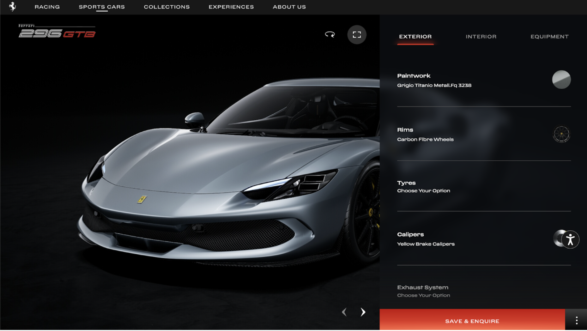
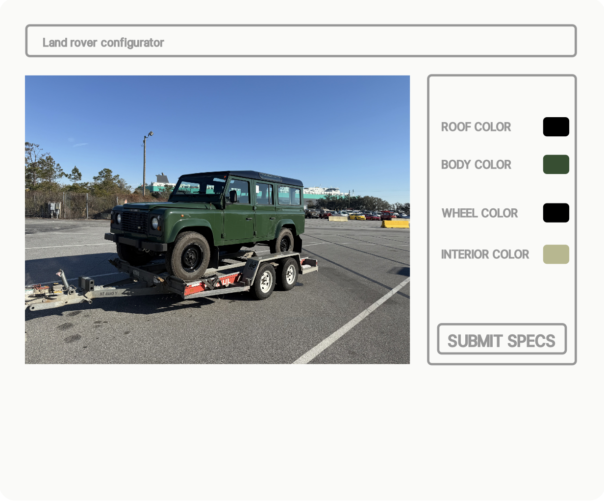

# Midterm proposal

## Overview
I currently import bespoke Land Rovers from Italy for American clients. At the moment, my customer discovery is done in person, and the customers configure their spec over the phone. It is hard to send them real-time visualizations of what their spec will look like, so oftentimes, they have to wait until the car arrives to know what it will actually look like.

Growing up, I used to fantasize a lot about owning nice cars, so I would spend hours choosing the colors and options for hypothetical cars on luxury car websites. 

For this project, I would like to build a landing page for my business that includes:
- A car image
- Some information about the business
- A car configurator with a "Submit Spec" button

This page would provide the ideal landing page for an advertising campaign and would add credibility to my business.

## Inspiration

## Skills Needed
I imagine I will need:
- **HTML** for structuring the page
- **CSS** for styling and layout
- **JavaScript** for interactive elements

I don’t think I will incorporate a live 3D rendering into my website. Instead, I will use a single angle of the car. This allows me to render stills of the car in all different specs (I don’t offer that many) and display them dynamically on the website based on user selections.

## Skills to Learn
- JavaScript for handling interactive elements
- Configuration saver for the order form
- Image switching based on selected specifications

## Wireframe

