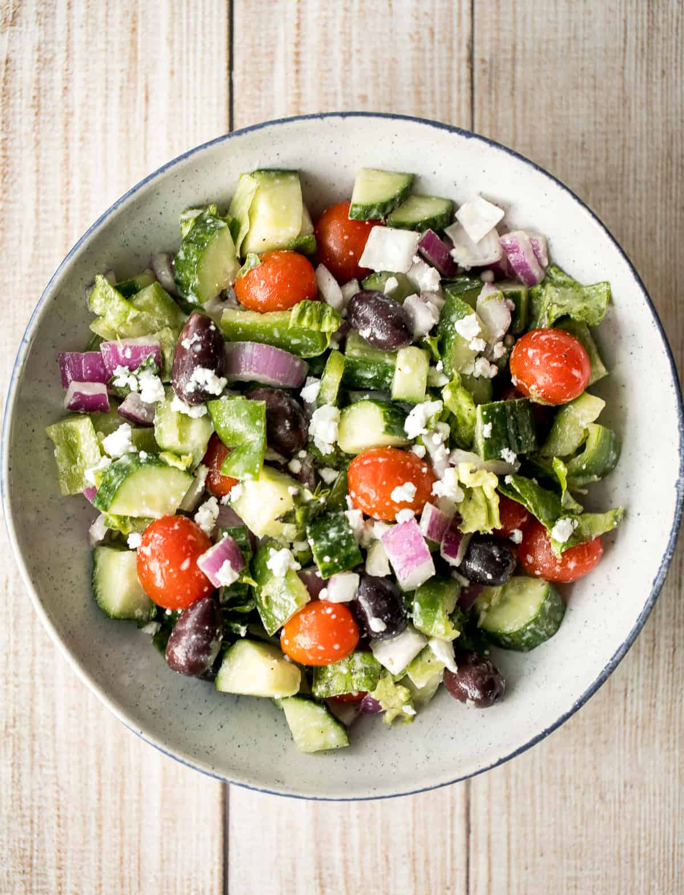

# Greek Salad Recipe

**Description**
>Delicious and simple salad that you can quickly and easily make. Perfect for those warm summer days.

## Ingredients
1. Tomato
2. Feta Cheese
3. Onion
4. Cucumber
5. Olives
6. Olive Oil
7. Vinegar

### Instructions
1. Slice the tomato, Onion, and Cucumber into small chunks
2. add the olives
3. Crumble the Feta in your hand and add to the salad
4. add a generous amount of olive oil
5. add a dash of vinegar
6. enjoy!