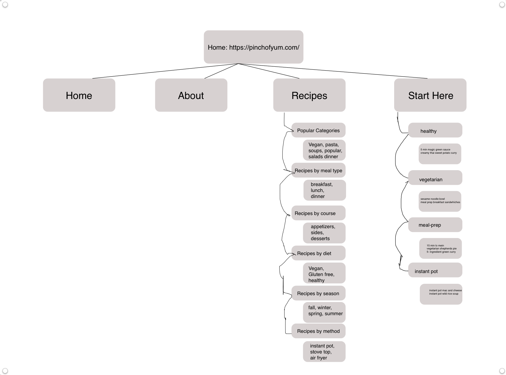
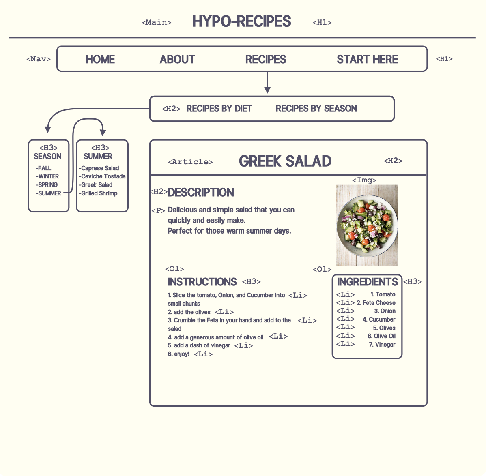

# Week 2 Homework #

## Blaise Fleury's reaction to wireframing article ##

This article reiterated many long held beliefs I have had about design thinking. This however, is the first time I have seen these beliefs fleshed out specifically in the context of web development. As the author said, while it can be tempting to jump right into creating a beautiful website, the most important part of the process is understanding your mission. First you need to understand what the problem is. This understanding can be gained from your employers or, even better, from the very clients whom this product will serve. Once this foundational question is answered, wire framing allows you to quickly iterate the website and refine the product without wasting unnescary time on colors and shading. One aspect of design thinking, in regards to web development, that had never occurred to me was that you need to tailor the fidelity of your wire frames to the tastes and understanding of the person for whom you are wire framing. 

## Site Map of Recipe Website PINCH OF YUM

This is the site map diagram of the website [PINCHOFYUM](https://pinchofyum.com/)

## Wire Frame for my hypothetical recipe site

## My HTML vestion of that wireframe ##

please click on index.html and follow the instructions

